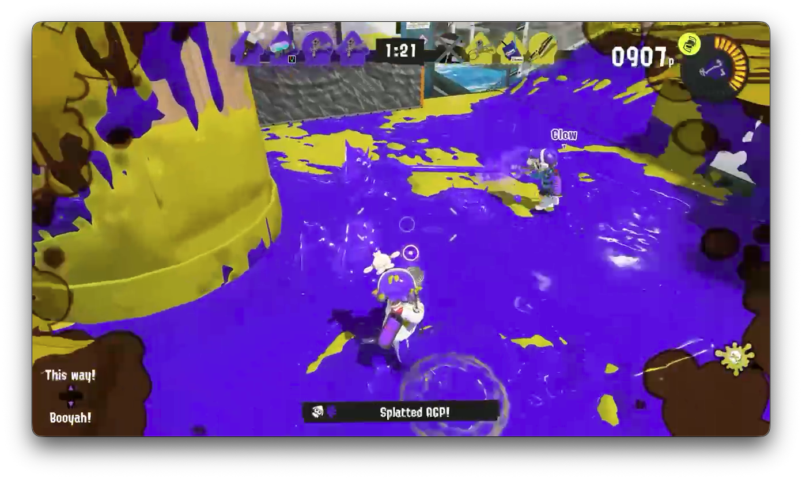

# Narrador IA para Splatoon

Demo de Streamlit y de narrador en carpeta demos/

## Equipo

- Castro Camacho René Antonio
- González Gastélum Marco Vinicio
- Torres Lizarraga Yair
- Barraza Ontiveros Armando de Jesús

## Aspectos a analizar

- Nivel de vida (CNN): penumbra en bordes de pantalla, con color de tinta enemiga.
- Habilidad definitiva cargando y disponible (CNN): medidor en zona superior derecha.
- Tiempo de partida (OCR): temporizador en zona central superior.
- Número de kills realizadas por el jugador, y veces que murió (OCR): etiquetas "Splatted <nombre>" en la zona central inferior.



## Obtención de datos

Se tomaron videos de partidas de Splatoon 3 y extrajo un frame por cada segundo del video. Estos fueron clasificados para las categorías de vida (ok, bajo, medio, critico) y estatus de habilidad ultimate (lista, no lista).

## Clasificación

Se realizó una aplicación en Tkinter para lograr una clasificación rápida de los datos. Esta se encuentra en labelling-app/main.py. Este lee los parametros en dataset/parametros.jsonc, y ahí se establecen las categorías (vida y ultimate) y las zonas a las que corresponde para su respectivo dataset.

## Entrenamiento de modelo

Se entrenaron dos modelos CNN en TensorFlow. El código de este está en entrenar-modelo.py. 

El modelo de estatus de la habilidad ultimate se hizo en 5 épocas y logró un 99.18% de acierto y 0.04% de pérdida.

<details>
<summary>Log de entrenamiento</summary>

```
iniciando entrenamiento de ultimate
Found 2448 files belonging to 2 classes.
Using 1714 files for training.
Using 734 files for validation.
Epoch 1/5
54/54 ━━━━━━━━━━━━━━━━━━━━ 11s 166ms/step - accuracy: 0.9539 - loss: 0.1607 - val_accuracy: 0.9918 - val_loss: 0.0614
Epoch 2/5
54/54 ━━━━━━━━━━━━━━━━━━━━ 7s 122ms/step - accuracy: 0.9965 - loss: 0.0348 - val_accuracy: 0.9918 - val_loss: 0.0486
Epoch 3/5
54/54 ━━━━━━━━━━━━━━━━━━━━ 7s 129ms/step - accuracy: 0.9971 - loss: 0.0274 - val_accuracy: 0.9918 - val_loss: 0.0472
Epoch 4/5
54/54 ━━━━━━━━━━━━━━━━━━━━ 7s 126ms/step - accuracy: 0.9965 - loss: 0.0243 - val_accuracy: 0.9932 - val_loss: 0.0437
Epoch 5/5
54/54 ━━━━━━━━━━━━━━━━━━━━ 7s 126ms/step - accuracy: 0.9977 - loss: 0.0221 - val_accuracy: 0.9918 - val_loss: 0.0470
```
</details>

El modelo de nivel de vida se hizo en 30 épocas y logró un máximo de 92% de acierto y 0.23% de pérdida. Este modelo es muy dificil de entrenar, debido a la dificultad en la forma en que se lee la vida en Splatoon (el indicador de vida es un efecto de penumbra en los bordes de la pantalla, con el color de tinta del equipo enemigo. Esto ocasiona un conflicto ya que el color de tinta en el suelo puede hacer conflicto cn esto)

<details>
<summary>
Log de entrenamiento
</summary>

```
iniciando entrenamiento de health
Found 1419 files belonging to 4 classes.
Using 994 files for training.
Using 425 files for validation.
Epoch 1/30
32/32 ━━━━━━━━━━━━━━━━━━━━ 10s 201ms/step - accuracy: 0.6026 - loss: 1.2088 - val_accuracy: 0.7765 - val_loss: 0.7090
Epoch 2/30
32/32 ━━━━━━━━━━━━━━━━━━━━ 5s 141ms/step - accuracy: 0.6730 - loss: 1.0038 - val_accuracy: 0.8282 - val_loss: 0.4736
Epoch 3/30
32/32 ━━━━━━━━━━━━━━━━━━━━ 5s 146ms/step - accuracy: 0.7324 - loss: 0.7662 - val_accuracy: 0.8518 - val_loss: 0.4251
Epoch 4/30
32/32 ━━━━━━━━━━━━━━━━━━━━ 5s 145ms/step - accuracy: 0.7777 - loss: 0.6737 - val_accuracy: 0.8776 - val_loss: 0.3511
Epoch 5/30
32/32 ━━━━━━━━━━━━━━━━━━━━ 5s 145ms/step - accuracy: 0.7928 - loss: 0.6019 - val_accuracy: 0.8871 - val_loss: 0.3277
Epoch 6/30
32/32 ━━━━━━━━━━━━━━━━━━━━ 5s 142ms/step - accuracy: 0.8109 - loss: 0.5040 - val_accuracy: 0.8729 - val_loss: 0.3265
Epoch 7/30
32/32 ━━━━━━━━━━━━━━━━━━━━ 5s 154ms/step - accuracy: 0.8521 - loss: 0.4167 - val_accuracy: 0.8800 - val_loss: 0.3081
Epoch 8/30
32/32 ━━━━━━━━━━━━━━━━━━━━ 5s 148ms/step - accuracy: 0.8491 - loss: 0.4204 - val_accuracy: 0.8518 - val_loss: 0.3869
Epoch 9/30
32/32 ━━━━━━━━━━━━━━━━━━━━ 5s 159ms/step - accuracy: 0.8652 - loss: 0.3834 - val_accuracy: 0.8776 - val_loss: 0.3145
Epoch 10/30
32/32 ━━━━━━━━━━━━━━━━━━━━ 5s 139ms/step - accuracy: 0.8742 - loss: 0.3618 - val_accuracy: 0.8871 - val_loss: 0.2853
Epoch 11/30
32/32 ━━━━━━━━━━━━━━━━━━━━ 5s 148ms/step - accuracy: 0.9014 - loss: 0.3010 - val_accuracy: 0.9082 - val_loss: 0.2577
Epoch 12/30
32/32 ━━━━━━━━━━━━━━━━━━━━ 5s 147ms/step - accuracy: 0.8823 - loss: 0.3405 - val_accuracy: 0.8800 - val_loss: 0.3660
Epoch 13/30
32/32 ━━━━━━━━━━━━━━━━━━━━ 5s 155ms/step - accuracy: 0.8984 - loss: 0.2731 - val_accuracy: 0.9012 - val_loss: 0.2496
Epoch 14/30
32/32 ━━━━━━━━━━━━━━━━━━━━ 5s 164ms/step - accuracy: 0.9095 - loss: 0.2433 - val_accuracy: 0.8871 - val_loss: 0.2759
Epoch 15/30
32/32 ━━━━━━━━━━━━━━━━━━━━ 5s 166ms/step - accuracy: 0.9185 - loss: 0.2152 - val_accuracy: 0.9106 - val_loss: 0.2497
Epoch 16/30
32/32 ━━━━━━━━━━━━━━━━━━━━ 5s 151ms/step - accuracy: 0.9266 - loss: 0.1988 - val_accuracy: 0.9082 - val_loss: 0.2442
Epoch 17/30
32/32 ━━━━━━━━━━━━━━━━━━━━ 5s 160ms/step - accuracy: 0.9256 - loss: 0.2064 - val_accuracy: 0.8494 - val_loss: 0.3929
Epoch 18/30
32/32 ━━━━━━━━━━━━━━━━━━━━ 5s 156ms/step - accuracy: 0.9085 - loss: 0.2365 - val_accuracy: 0.9176 - val_loss: 0.2390
Epoch 19/30
32/32 ━━━━━━━━━━━━━━━━━━━━ 5s 156ms/step - accuracy: 0.9326 - loss: 0.1786 - val_accuracy: 0.9035 - val_loss: 0.2585
Epoch 20/30
32/32 ━━━━━━━━━━━━━━━━━━━━ 5s 157ms/step - accuracy: 0.9145 - loss: 0.2377 - val_accuracy: 0.9059 - val_loss: 0.2641
Epoch 21/30
32/32 ━━━━━━━━━━━━━━━━━━━━ 6s 190ms/step - accuracy: 0.9416 - loss: 0.1633 - val_accuracy: 0.9224 - val_loss: 0.2352
Epoch 22/30
32/32 ━━━━━━━━━━━━━━━━━━━━ 5s 135ms/step - accuracy: 0.9145 - loss: 0.1940 - val_accuracy: 0.8988 - val_loss: 0.2575
Epoch 23/30
32/32 ━━━━━━━━━━━━━━━━━━━━ 5s 141ms/step - accuracy: 0.9095 - loss: 0.2293 - val_accuracy: 0.9129 - val_loss: 0.2375
Epoch 24/30
32/32 ━━━━━━━━━━━━━━━━━━━━ 5s 162ms/step - accuracy: 0.9316 - loss: 0.1917 - val_accuracy: 0.9247 - val_loss: 0.2428
Epoch 25/30
32/32 ━━━━━━━━━━━━━━━━━━━━ 5s 151ms/step - accuracy: 0.9437 - loss: 0.1480 - val_accuracy: 0.9200 - val_loss: 0.2491
Epoch 26/30
32/32 ━━━━━━━━━━━━━━━━━━━━ 5s 152ms/step - accuracy: 0.9517 - loss: 0.1282 - val_accuracy: 0.9106 - val_loss: 0.2707
Epoch 27/30
32/32 ━━━━━━━━━━━━━━━━━━━━ 5s 147ms/step - accuracy: 0.9145 - loss: 0.2165 - val_accuracy: 0.9200 - val_loss: 0.2354
Epoch 28/30
32/32 ━━━━━━━━━━━━━━━━━━━━ 4s 129ms/step - accuracy: 0.9577 - loss: 0.1442 - val_accuracy: 0.9153 - val_loss: 0.2391
Epoch 29/30
32/32 ━━━━━━━━━━━━━━━━━━━━ 4s 127ms/step - accuracy: 0.9487 - loss: 0.1254 - val_accuracy: 0.9200 - val_loss: 0.2477
Epoch 30/30
32/32 ━━━━━━━━━━━━━━━━━━━━ 4s 125ms/step - accuracy: 0.9356 - loss: 0.1475 - val_accuracy: 0.9153 - val_loss: 0.2609
```
</details>

## Análisis

Hicimos una Jupyter Notebook que se usa para el análisis del video. Usamos los siguientes modelos de Hugging Face
para la generación de texto y text-to-speech.

- Generación de texto: [unsloth/gemma-4-E4B-it-GGUF (Q8_0)](https://huggingface.co/unsloth/gemma-4-E4B-it-GGUF)
- Text-to-speech: [Supertone/supertonic-3](https://huggingface.co/Supertone/supertonic-3)

El análisis corresponde a 

- Obtener por OCR (pytesseract) el tiempo restante de la partida
- Obtener por OCR (pytesseract) el número de kills realizadas
- Obtener por OCR (pytesseract) si murió el jugador
- Recortar la región correspondiente al nivel de habilidad ultimate (CNN, models/ultimate.keras)
- Recortar las secciones laterales de la pantalla, que correspondan a la penumbra del nivel de vida (CNN, models/health.keras)

Pasamos a gemma4-e4b para generar algo a mencionar sobre los distintos momentos a lo largo de la partida, y luego a supertonic-3
la generación de los clips de voz.

Luego, utilizamos ffmpeg para unir los clips generados con el gameplay y exportar un video final.

## Interfaz

Desarrollamos una interfaz web usando Streamlit para la selección del video y la visualización del progreso y resultado. 
Este se encuentra en streamlit.py (`streamlit run streamlit.py`)
